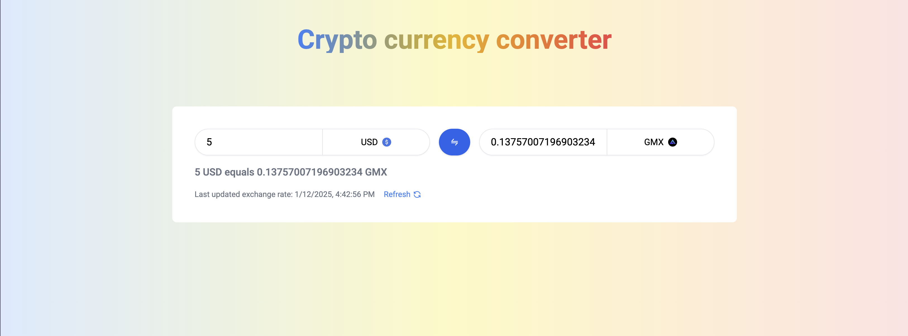

# Currency Converter App

A React application that allows users to convert between different currencies.


## Features

- Support for multiple currencies
- Responsive design for mobile and desktop
- Swap currencies functionality
- Search and filter currencies

## Getting Started

### Prerequisites

- Node.js 18 or higher
- pnpm package manager

### Installation

1. Clone the repository

2. Install dependencies:

```bash
pnpm install
```

3. Start the development server:

```bash
pnpm dev
```

4. Open your browser and navigate to `http://localhost:3000` to see the application.
