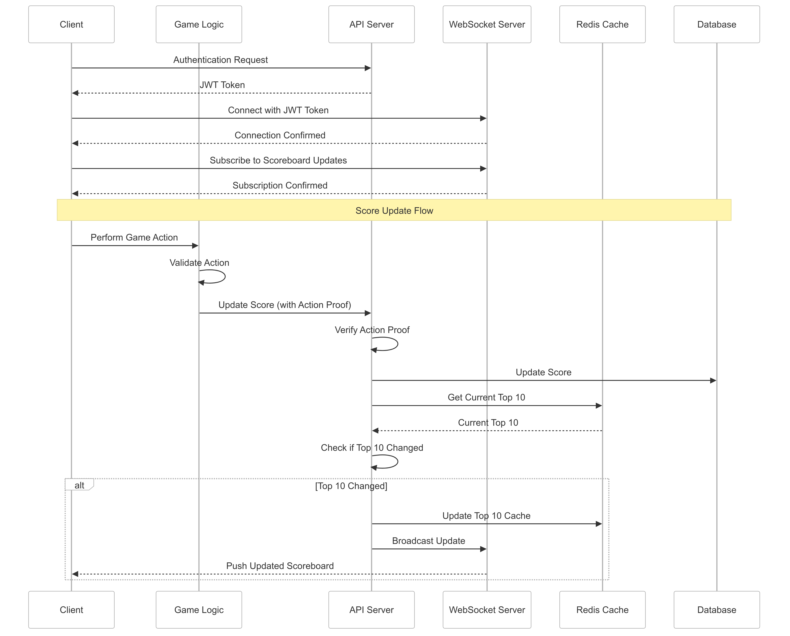

# Live Scoreboard System Specification

## Overview

This document specifies the backend module for a real-time scoreboard system that tracks and displays the top 10 user scores. The system ensures secure score updates and provides live updates to all connected clients.

## System Architecture

### Components

1. **API Server**

   - Manages user authentication
   - Handles score update requests
   - Validates score updates
   - Maintains score data integrity

2. **WebSocket Server**

   - Manages real-time connections with clients
   - Broadcasts score updates to connected clients

3. **Database**

   - Stores user scores and authentication data
   - Optimized for frequent reads and updates

4. **Redis Cache**
   - Caches top 10 scores for quick retrieval
   - Reduces database load

## Flow Diagram (using [Mermaid](https://mermaid.js.org/))

## Future Improvements

1. **Features**

   - Historical score tracking
   - Achievement system
   - Leaderboard by time periods (daily, weekly, monthly)
